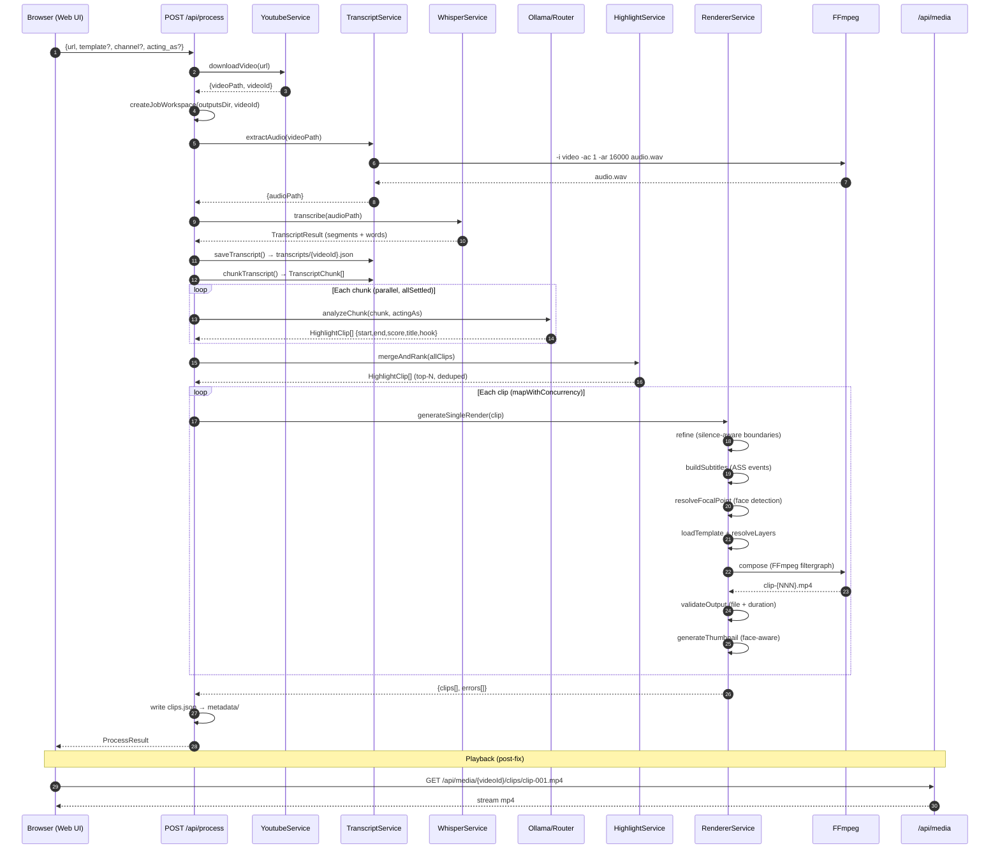
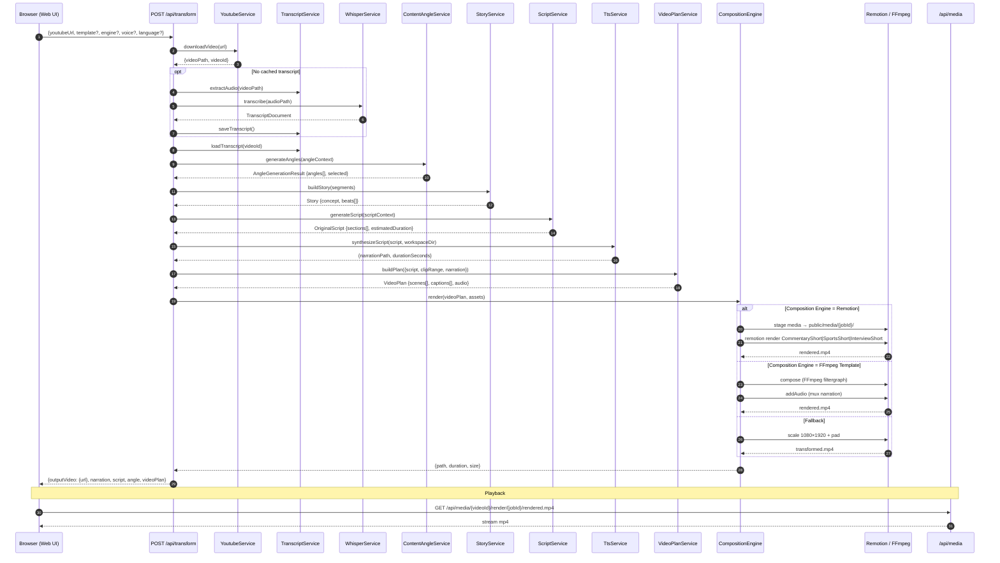
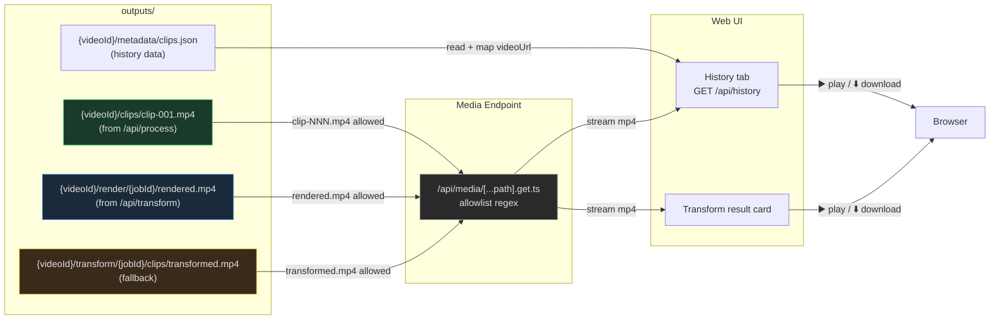

# Flow Process: Video Clip Builder (Activity Diagram)

Diagram alur aktivitas lengkap dari input YouTube URL sampai video clip jadi siap diputar/diunduh.

## Activity Diagram — End-to-End

```mermaid
flowchart TD
    START([🎬 START]) --> INPUT["Input\nYouTube URL + options"]
    INPUT --> DL["Download Video\nYoutubeService → yt-dlp → mp4\noutputs/{videoId}/downloads/"]
    DL --> WKSP["Create Job Workspace\noutputs/{videoId}/\n{downloads,temp,transcripts,clips,\nsubtitles,thumbnails,metadata}"]
    WKSP --> AUD["Extract Audio\nTranscriptService → FFmpeg\nmono 16kHz WAV"]
    AUD --> TRANS["Transcribe Audio\nWhisperService\nsegments + word timestamps"]
    TRANS --> SAVE["Save Transcript\noutputs/{videoId}/transcripts/{videoId}.json"]

    SAVE --> BRANCH{"Pilih Pipeline"}

    %% ── PATH A: /api/process ──
    BRANCH -->|"/api/process"| CHUNK["Chunk Transcript\noverlap-aware, LLM-sized chunks"]
    CHUNK --> PAR_AI{"⚡ PARALLEL\nAnalyze Each Chunk\nOllamaService × N chunks\n(Ollama / 9Router)"}
    PAR_AI --> MERGE["Merge & Rank Highlights\nHighlightService → dedup >50% overlap\nclamp durasi [min,max]\ntop-N by score"]
    MERGE --> HAS_CLIPS{"clips > 0?"}
    HAS_CLIPS -->|No| ERR1["❌ Error:\nNo clips found"]
    HAS_CLIPS -->|Yes| PAR_CLIP{"⚡ FOR EACH CLIP\nmapWithConcurrency\n(concurrent rendering)"}

    PAR_CLIP --> REFINE["Refine Range\nClipRefinementService\nsilence-aware boundaries\npadding lead-in/trailing"]
    REFINE --> SUB["Build Subtitles\nSubtitleService\nword-level ASS events\nkeyword highlighting"]
    SUB --> FOCAL["Resolve Focal Point\nReframeService\nface detection → 9:16 crop"]
    FOCAL --> TMPL["Load Template\nTemplateService\nresolve layers + bindings\ndata-driven layout"]
    TMPL --> RENDER_A["Render Clip\nTemplateRendererService\nFFmpeg filtergraph (single-pass)\ncrop 9:16 + subtitles + layers\nencode libx264 + faststart"]
    RENDER_A --> VALIDATE["Validate Output\nfile exists + non-empty\nduration ±2s"]
    VALIDATE --> THUMB["Generate Thumbnail\nThumbnailService\nsample frames → face-aware pick\noutputs/{videoId}/thumbnails/clip-{NNN}.jpg"]
    THUMB --> META["Save Metadata\noutputs/{videoId}/metadata/clips.json"]
    META --> RESULT_A["Return ProcessResult\n{video, transcript, clips[], errors[]}"]
    RESULT_A --> SERVE["Media Serving\n/api/media/{videoId}/clips/clip-{NNN}.mp4\n(allowlist: clips/clip-NNN.mp4)"]
    SERVE --> HISTORY["History Aggregation\nGET /api/history\nmaps clips → videoUrl + thumbnailUrl"]
    HISTORY --> PLAY_A["▶️ Play / ⬇️ Download\nvia /api/media URLs\nHistory tab in Web UI"]

    %% ── PATH B: /api/transform ──
    BRANCH -->|"/api/transform"| ANGLE["Generate Angles\nContentAngleService\n3-5 editorial angles per moment"]
    ANGLE --> STORY["Derive Story Beats\nStoryService\nsource-grounded narrative"]
    STORY --> SCRIPT["Write Script\nScriptService\noriginal narration\n{hook, body, conclusion}"]
    SCRIPT --> TTS["Synthesize TTS\nTtsService (edge-tts / OpenAI)\n→ narration MP3"]
    TTS --> PLAN["Build Video Plan\nVideoPlanService\ntimeline scenes + timing"]
    PLAN --> COMPOSE{"Composition Engine\nengine.factory.ts"}
    COMPOSE -->|Remotion| REMOTION["Remotion Engine\nstage media → public/media/\nrun CLI → CommentaryShort|SportsShort\noutputs/{videoId}/render/{jobId}/rendered.mp4"]
    COMPOSE -->|"FFmpeg Template"| FFTEMP["FFmpeg Template Engine\ncompose + addAudio mux\noutputs/{videoId}/render/{jobId}/rendered.mp4"]
    COMPOSE -->|Fallback| FALL["Fallback\nscale 1080×1920 + pad\noutputs/{videoId}/transform/{jobId}/clips/transformed.mp4"]

    REMOTION --> RESULT_B["Return transform result\n{angle, story, script, narration, videoPlan,\noutputVideo: {path, duration, size}}"]
    FFTEMP --> RESULT_B
    FALL --> RESULT_B

    RESULT_B --> SERVE_B["Media Serving\n/api/media/{videoId}/render/{jobId}/rendered.mp4\n(allowlist: render/.../rendered.mp4)"]
    SERVE_B --> PLAYER["▶️ Play / ⬇️ Download\nvia /api/media URLs\nTransform result card in Web UI"]

    ERR1 --> END([END])
    PLAY_A --> END
    PLAYER --> END

    %% ── Styling ──
    classDef pipelineA fill:#1a3a2a,stroke:#4ade80,color:#e0e0e0
    classDef pipelineB fill:#1a2a3a,stroke:#60a5fa,color:#e0e0e0
    classDef shared fill:#2a2a2a,stroke:#a0a0a0,color:#e0e0e0
    classDef serve fill:#3a2a1a,stroke:#fbbf24,color:#e0e0e0
    classDef error fill:#3a1a1a,stroke:#f87171,color:#e0e0e0

    class CHUNK,PAR_AI,MERGE,HAS_CLIPS,PAR_CLIP,REFINE,SUB,FOCAL,TMPL,RENDER_A,VALIDATE,THUMB,META,RESULT_A pipelineA
    class ANGLE,STORY,SCRIPT,TTS,PLAN,COMPOSE,REMOTION,FFTEMP,FALL,RESULT_B pipelineB
    class START,INPUT,DL,WKSP,AUD,TRANS,SAVE shared
    class SERVE,HISTORY,PLAY_A,SERVE_B,PLAYER serve
    class ERR1 error
```



## Sequence Diagram — /api/process (Highlight Extraction)



## Sequence Diagram — /api/transform (AI Viral Transformer)



## Media Serving & Playback Flow



## File Artifact Map

```
outputs/{videoId}/
├── downloads/
│   └── {videoId}.mp4              ← YouTube video (yt-dlp)
├── temp/
│   ├── audio.wav                  ← extracted audio (FFmpeg)
│   └── *.tmp                      ← temp files (thumbnail, focal point)
├── transcripts/
│   └── {videoId}.json             ← Whisper transcript (segments + words)
├── clips/                         ← /api/process output
│   ├── clip-001.mp4               ← rendered highlight clip
│   ├── clip-002.mp4
│   └── ...
├── subtitles/
│   ├── clip-001.ass               ← ASS subtitle per clip
│   └── ...
├── thumbnails/
│   ├── clip-001.jpg               ← thumbnail per clip
│   └── ...
├── metadata/
│   └── clips.json                 ← RenderedClipMetadata[] (all clips)
├── render/                        ← /api/transform output (composition engine)
│   └── {jobId}/
│       ├── rendered.mp4           ← final transformed video
│       └── input-props.json       ← Remotion props (if using Remotion)
└── transform/                     ← /api/transform fallback output
    └── {jobId}/
        ├── clips/
        │   └── transformed.mp4    ← fallback render
        └── voice/
            └── voice/
                └── narration.mp3  ← TTS narration audio
```

## Key Architectural Patterns

| Pattern | Location | Purpose |
|---|---|---|
| Fault Isolation | `Promise.allSettled()` chunk analysis | 1 chunk gagal ≠ semua gagal |
| Concurrent Rendering | `mapWithConcurrency` per-clip render | Parallel clip processing |
| Data-Driven Templates | `TemplateService` → `TemplateRendererService` | Renderer tidak tahu layout — template yang define |
| Silence-Aware Cuts | `ClipRefinementService` + `detectSilences()` | Natural cut points di jeda bicara |
| Retry + Validation | Every layer (download, AI, render) | Auto-retry + output validation |
| Allowlist Media Serving | `server/api/media/[...path].get.ts` | Hanya serve file yang diizinkan |
| Per-Video Isolation | `createJobWorkspace()` | Semua artifact terisolasi per videoId |
| Config-Driven | `.env` → `env.ts` | Semua batas/threshold paths dikontrol env |

## Environment Config Reference

| Variable | Default | Purpose |
|---|---|---|
| `OUTPUTS_DIR` | `outputs` | Root output directory |
| `HIGHLIGHT_MIN_SECONDS` | 15 | Minimum clip duration |
| `HIGHLIGHT_MAX_SECONDS` | 60 | Maximum clip duration |
| `HIGHLIGHT_TOP_N` | 5 | Number of top clips to render |
| `CLIP_MIN_SECONDS` | 10 | Minimum rendered clip duration |
| `CLIP_MAX_SECONDS` | 90 | Maximum rendered clip duration |
| `CLIP_MAX_CONCURRENCY` | 3 | Max parallel clip renders |
| `COMPOSITION_ENGINE` | `ffmpeg-template` | Engine: `remotion` or `ffmpeg-template` |
| `TTS_PROVIDER` | `edge-tts` | TTS backend: `edge-tts` or `openai` |
| `AI_PROVIDER` | `ollama` | AI backend: `ollama` or `router` |
