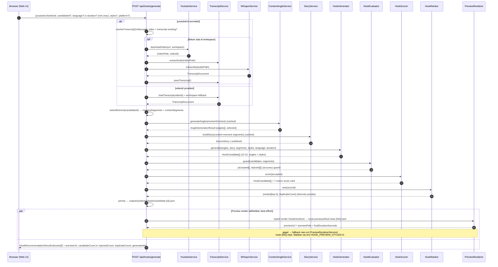
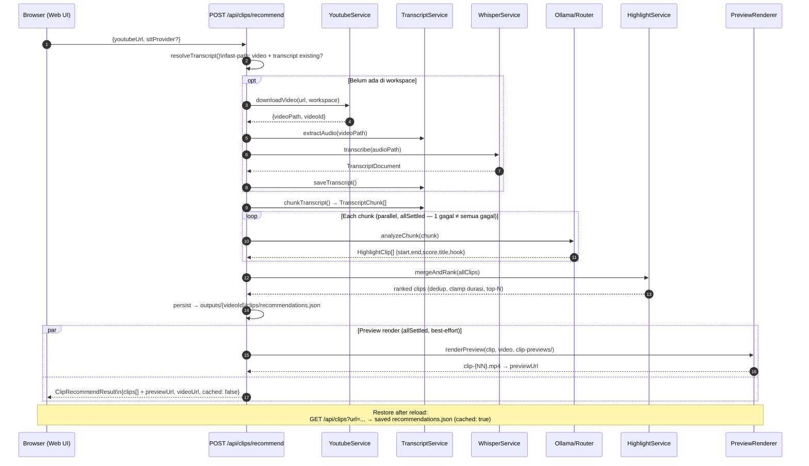
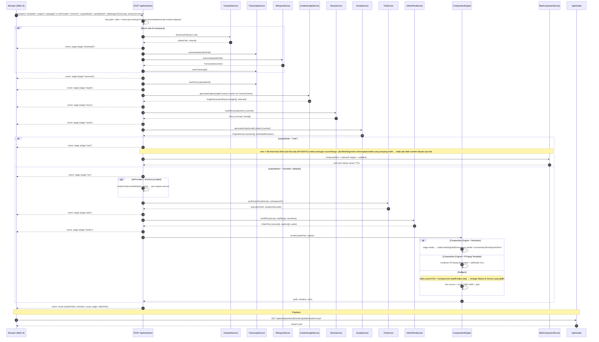

# Flow Process: Video Clip Builder (Activity Diagram)

Diagram alur aktivitas lengkap dari input YouTube URL sampai video jadi siap diputar/diunduh.

> **Update:** pipeline lama `POST /api/process` (highlight extraction + batch clip render) sudah dihapus.
> Alur aktif kini tiga tahap: **`/api/hooks/generate`** → **`/api/clips/recommend`** → **`/api/transform`**,
> plus endpoint restore `GET /api/hooks` dan `GET /api/clips`.

## Activity Diagram — End-to-End

```mermaid
flowchart TD
    START([🎬 START]) --> INPUT["Input\nYouTube URL"]
    INPUT --> RESOLVE{"Video + transcript\nsudah ada di\noutputs/{videoId}/?"}

    RESOLVE -->|"Ya"| REUSE["⚡ FAST-PATH\nPakai video & transcript existing\n(tanpa yt-dlp, tanpa Whisper)\nlog: Using existing video and transcript"]
    RESOLVE -->|"Tidak"| DL["Download Video\nYoutubeService → yt-dlp → mp4\noutputs/{videoId}/downloads/{videoId}.mp4"]
    DL --> WKSP["Create Job Workspace\ncreateJobWorkspace()\noutputs/{videoId}/\n{downloads,temp,transcripts,...}"]
    WKSP --> AUD["Extract Audio\nTranscriptService → FFmpeg\nmono 16kHz WAV"]
    AUD --> TRANS["Transcribe Audio\nWhisperService\nsegments + word timestamps"]
    TRANS --> SAVE["Save Transcript\noutputs/{videoId}/transcripts/{videoId}.json"]
    SAVE --> REUSE

    REUSE --> BRANCH{"Pilih Pipeline"}

    %% ── PATH 1: /api/hooks/generate ──
    BRANCH -->|"/api/hooks/generate"| H_CACHE{"hooks/candidate-{id}.json\nsudah ada?"}
    H_CACHE -->|"Ya"| H_SAVED["Return saved result\ncached response"]
    H_CACHE -->|"Tidak"| H_MOM["Select Moment\nHookController → selectMoment\nsegment window + context"]
    H_MOM --> H_ANG["Generate Angles\nContentAngleService"]
    H_ANG --> H_STORY["Derive Story Beats\nStoryService"]
    H_STORY --> H_GEN["Generate Hook Candidates\nHookGenerator\n10-15 candidates (angles × styles)"]
    H_GEN --> H_GUARD["Accuracy Guard\nHookEvaluator\nreject misleading/clickbait"]
    H_GUARD --> H_SCORE["Score 7 Metrics\nHookScorer\ncuriosity..accuracy → final"]
    H_SCORE --> H_RANK["Rank Top-5\nHookRanker\ndedup + diversity penalty"]
    H_RANK --> H_SAVE["Persist Result\noutputs/{videoId}/hooks/candidate-{id}.json"]
    H_SAVE --> H_PREV["⚡ PARALLEL Preview Render\nPromise.allSettled\nhook-previews/hook-{NN}.mp4\n(1 gagal ≠ semua gagal)"]
    H_PREV --> RESULT_C["Return HookRecommendationResult\n{hooks[5] + previewUrl, candidateCount,\nrejectedCount, duplicateCount}"]
    RESULT_C --> PICK["🎯 Pilih hook\n→ umpan ke /api/transform\n(candidateId)"]

    %% ── PATH 2: /api/clips/recommend ──
    BRANCH -->|"/api/clips/recommend"| C_CACHE{"clips/recommendations.json\nsudah ada?"}
    C_CACHE -->|"Ya"| C_SAVED["Return saved result\n{cached: true}"]
    C_CACHE -->|"Tidak"| CHUNK["Chunk Transcript\noverlap-aware, LLM-sized chunks"]
    CHUNK --> PAR_AI{"⚡ PARALLEL\nAnalyze Each Chunk\nOllamaService × N chunks\n(Ollama / 9Router)"}
    PAR_AI --> MERGE["Merge & Rank\nHighlightService → dedup overlap\nclamp durasi [min,max]\ntop-N by score"]
    MERGE --> C_SAVE["Persist Result\noutputs/{videoId}/clips/recommendations.json"]
    C_SAVE --> C_PREV["⚡ PARALLEL Preview Render\nPromise.allSettled\nclip-previews/clip-{NN}.mp4"]
    C_PREV --> RESULT_D["Return ClipRecommendResult\n{clips[] + previewUrl,\nvideoUrl, cached: false}"]
    RESULT_D --> SEL_CLIP["🎯 Pilih klip range\n→ umpan ke /api/transform\n(outputMode: reel)"]

    %% ── PATH 3: /api/transform ──
    BRANCH -->|"/api/transform"| ANGLE["Generate Angles\nContentAngleService\n(cache via ContentCache)"]
    ANGLE --> STORY["Derive Story Beats\nStoryService\nsource-grounded narrative"]
    STORY --> SCRIPT["Write Script\nScriptService\noriginal narration\n{hook, body, conclusion}"]
    SCRIPT --> TTS["Synthesize TTS\nTtsService (edge-tts / OpenAI)\n→ narration MP3\n(provider/voice override per request)"]
    TTS --> MODE{"outputMode?"}
    MODE -->|"narration"| PLAN["Build Video Plan\nVideoPlanService\ntimeline scenes + timing"]
    PLAN --> COMPOSE{"Composition Engine\nengine.factory.ts"}
    COMPOSE -->|Remotion| REMOTION["Remotion Engine\nstage media → public/media/\nrun CLI → CommentaryShort|SportsShort"]
    COMPOSE -->|"FFmpeg Template"| FFTEMP["FFmpeg Template Engine\ncompose + addAudio mux"]
    COMPOSE -->|Fallback| FALL["Fallback\nscale 1080×1920 + pad"]
    MODE -->|"reel"| REEL["ReelComposerService\nintro = styled final-hook-{NN}.mp4 (WYSIWYG)\natau cut sourceRange; planReelSegments\nguard anti-repeat (no second plays twice)\nconcat + segment subtitles\n→ reel.mp4 (tanpa narasi)"]

    REMOTION --> OUT["outputs/{videoId}/render/{jobId}/rendered.mp4\n(fallback: transform/{jobId}/clips/transformed.mp4)"]
    FFTEMP --> OUT
    FALL --> OUT
    REEL --> OUT_REEL["outputs/{videoId}/transform/{jobId}/clips/reel.mp4"]

    OUT --> RESULT_B["Return transform result\n{angle, story, script, narration, videoPlan,\noutputVideo: {path, duration, size}}"]
    OUT_REEL --> RESULT_B

    %% ── Serving ──
    RESULT_C --> SERVE["Media Serving\n/api/media/[...path] (allowlist)"]
    RESULT_D --> SERVE
    RESULT_B --> SERVE
    SERVE --> PLAY["▶️ Play / ⬇️ Download\nWeb UI (hook card / clip panel /\ntransform result card)"]

    PICK --> END([END])
    SEL_CLIP --> END
    PLAY --> END

    %% ── Styling ──
    classDef pipelineC fill:#3a1a2a,stroke:#e879f9,color:#e0e0e0
    classDef pipelineD fill:#1a3a2a,stroke:#4ade80,color:#e0e0e0
    classDef pipelineB fill:#1a2a3a,stroke:#60a5fa,color:#e0e0e0
    classDef shared fill:#2a2a2a,stroke:#a0a0a0,color:#e0e0e0
    classDef serve fill:#3a2a1a,stroke:#fbbf24,color:#e0e0e0

    class H_MOM,H_ANG,H_STORY,H_GEN,H_GUARD,H_SCORE,H_RANK,H_SAVE,H_PREV,RESULT_C,PICK,H_SAVED pipelineC
    class CHUNK,PAR_AI,MERGE,C_SAVE,C_PREV,RESULT_D,SEL_CLIP,C_SAVED pipelineD
    class ANGLE,STORY,SCRIPT,TTS,MODE,PLAN,COMPOSE,REMOTION,FFTEMP,FALL,REEL,OUT,OUT_REEL,RESULT_B pipelineB
    class START,INPUT,RESOLVE,REUSE,DL,WKSP,AUD,TRANS,SAVE shared
    class SERVE,PLAY serve
```



## Sequence Diagram — /api/hooks/generate (Hook Recommendation Engine)



## Sequence Diagram — /api/clips/recommend (Viral Clip Recommendation)



## Sequence Diagram — /api/transform (AI Viral Transformer, SSE)



## Media Serving & Playback Flow

```mermaid
flowchart LR
    subgraph Disk["outputs/"]
        A["{videoId}/render/{jobId}/rendered.mp4\n(from /api/transform narration)"]
        B["{videoId}/transform/{jobId}/clips/transformed.mp4\n(fallback render)"]
        C["{videoId}/transform/{jobId}/clips/reel.mp4\n(outputMode reel)"]
        D["{videoId}/transform/{jobId}/voice/voice/narration.mp3\n(TTS audio)"]
        E["{videoId}/clip-previews/clip-{NN}.mp4\n(preview /api/clips/recommend)"]
        F["{videoId}/hook-previews/hook-{NN}.mp4\n(preview /api/hooks/generate)"]
        G["{videoId}/clips/clip-NNN.mp4\n(legacy /api/process)"]
    end

    subgraph API["Media Endpoint"]
        M["/api/media/[...path].get.ts\nallowlist regex"]
    end

    subgraph FE["Web UI"]
        H["Hook card / Clip panel"]
        T["Transform result card"]
    end

    A -->|allowed| M
    B -->|allowed| M
    C -->|allowed| M
    D -->|allowed, audio/mpeg| M
    E -->|allowed| M
    F -->|allowed| M
    G -->|allowed (legacy artifact)| M

    M -->|"stream mp4/mpeg"| H
    M -->|"stream mp4/mpeg"| T

    H -->|"▶️ play / ⬇️ download"| BROWSER["Browser"]
    T -->|"▶️ play / ⬇️ download"| BROWSER

    style A fill:#1a2a3a,stroke:#60a5fa,color:#e0e0e0
    style C fill:#1a3a2a,stroke:#4ade80,color:#e0e0e0
    style E fill:#1a3a2a,stroke:#4ade80,color:#e0e0e0
    style F fill:#3a1a2a,stroke:#e879f9,color:#e0e0e0
    style M fill:#2a2a2a,stroke:#a0a0a0,color:#e0e0e0
```

## File Artifact Map

```
outputs/{videoId}/
├── downloads/
│   └── {videoId}.mp4              ← YouTube video (yt-dlp, dipakai ulang via fast-path)
├── temp/
│   ├── audio.wav                  ← extracted audio (FFmpeg)
│   └── *.tmp                      ← temp files (thumbnail, focal point)
├── transcripts/
│   └── {videoId}.json             ← Whisper transcript (segments + words)
├── hooks/                         ← /api/hooks/generate
│   └── candidate-{N}.json         ← HookRecommendationResult (persist)
├── hook-previews/
│   ├── final-hook-{NN}.mp4        ← styled final intro (HookIntroShort) —
│   │                                 dipakai ulang reel sebagai pembuka (WYSIWYG)
│   └── hook-{NN}.mp4              ← fallback raw cut per hook
├── clip-previews/
│   └── clip-{NN}.mp4              ← preview video per klip (/api/clips/recommend)
├── clips/                         ← /api/clips/recommend
│   ├── recommendations.json       ← ClipRecommendResult (persist)
│   └── clip-001.mp4               ← (legacy /api/process, tak lagi diproduksi)
├── subtitles/                     ← (legacy /api/process)
├── thumbnails/                    ← (legacy /api/process)
├── metadata/
│   └── clips.json                 ← (legacy; masih dibaca GET /api/history bila ada)
├── render/                        ← /api/transform output (composition engine)
│   └── {jobId}/
│       ├── rendered.mp4           ← final transformed video
│       └── input-props.json       ← Remotion props (if using Remotion)
└── transform/                     ← /api/transform fallback & reel output
    └── {jobId}/
        ├── clips/
        │   ├── transformed.mp4    ← fallback render
        │   └── reel.mp4           ← outputMode "reel"
        └── voice/
            └── voice/
                └── narration.mp3  ← TTS narration audio
```

## Key Architectural Patterns

| Pattern | Location | Purpose |
|---|---|---|
| Workspace Fast-Path | `resolveTranscript()` di clip/hook/transform controller | Cek `outputs/{videoId}/downloads/{videoId}.mp4` + transcript dulu (`fs.access`) — skip yt-dlp & Whisper untuk video yang sudah pernah diproses |
| Per-Video Isolation | `createJobWorkspace()` | Semua artifact terisolasi per videoId; `downloadVideo()` wajib terima workspace |
| Result Persistence + Restore | `hooks/candidate-{N}.json`, `clips/recommendations.json` + `GET /api/hooks`, `GET /api/clips` | Hasil tersimpan ke disk; UI restore tanpa menjalankan pipeline |
| Fault Isolation | `Promise.allSettled()` pada preview render (hook & clip controller) | 1 preview gagal ≠ semua gagal |
| Editorial Cache | `ContentCache` (`outputs/transform-cache/`) | Angle/story/script di-cache per videoId+candidateId+range |
| Data-Driven Templates | `TemplateService` → `TemplateRendererService` | Renderer tidak tahu layout — template yang define |
| Real-Time SSE Progress | `TransformController.onStage` + `server/api/transform.post.ts` | Stream `stage`/`result`/`error` events; UI update tiap stage live |
| Dual Output Mode | `outputMode: 'reel' \| 'narration'` | Reel = concat range terpilih (ReelComposerService); Narration = script → TTS → video plan → composition engine |
| Accuracy Guard | `HookEvaluator` (hook engine stage 2) | Tolak hook yang tidak didukung sumber (anti-clickbait) |
| 7-Metric Quality Card | `HookScorer` (hook engine stage 3) | Skor objektif 0-100: curiosity, retention, emotional, visual, clarity, relevance, accuracy → `final` |
| Diversity Ranking | `HookRanker` (hook engine stage 4) | Dedup semantic (>60% overlap) + diversity penalty → Top-5 |
| Reused Editorial Stages | `HookController` | Hook engine mengkonsumsi angle/story yang ada, tidak mengubah pipeline transform |
| Per-Request TTS Override | `createTtsServiceWith(kind, voice)` | User pilih provider/voice per request (`ttsProvider`, `ttsVoice`) |
| Allowlist Media Serving | `server/api/media/[...path].get.ts` | Hanya serve path yang cocok regex (render/transform/previews/narration) |
| Retry + Validation | Download, LLM calls, render | Auto-retry + output validation |

## Environment Config Reference

| Variable | Default | Purpose |
|---|---|---|
| `OUTPUTS_DIR` | `outputs` | Root output directory |
| `HIGHLIGHT_MIN_SECONDS` | 20 | Durasi minimum klip saat merge & rank (`HighlightService`) |
| `HIGHLIGHT_MAX_SECONDS` | 60 | Durasi maksimum klip saat merge & rank |
| `HIGHLIGHT_TOP_N` | 10 | Jumlah klip top-N hasil rank |
| `CLIP_MIN_SECONDS` | 15 | *(legacy — tidak lagi dipakai service aktif)* |
| `CLIP_MAX_SECONDS` | 90 | *(legacy — tidak lagi dipakai service aktif)* |
| `CLIP_MAX_CONCURRENCY` | 2 | *(legacy — tidak lagi dipakai service aktif)* |
| `COMPOSITION_ENGINE` | `ffmpeg-template` | Engine: `remotion` or `ffmpeg-template` |
| `TTS_PROVIDER` | `edge-tts` | TTS backend: `edge-tts` or `openai` (bisa di-override per request via `ttsProvider`/`ttsVoice`) |
| `AI_PROVIDER` | `ollama` | AI backend: `ollama` or `router` |

> Konfigurasi hook engine (jumlah kandidat, top-N, batas durasi window) di-hardcode di `src/container/index.ts` / controller — tidak punya env vars sendiri. Hasil hook & klip kini dipersist ke disk (`hooks/`, `clips/recommendations.json`) dan dapat diumpankan ke `/api/transform` via `candidateId` + `clipRanges`.
