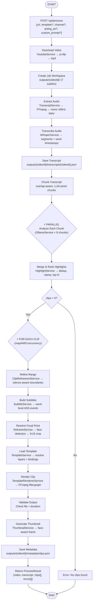
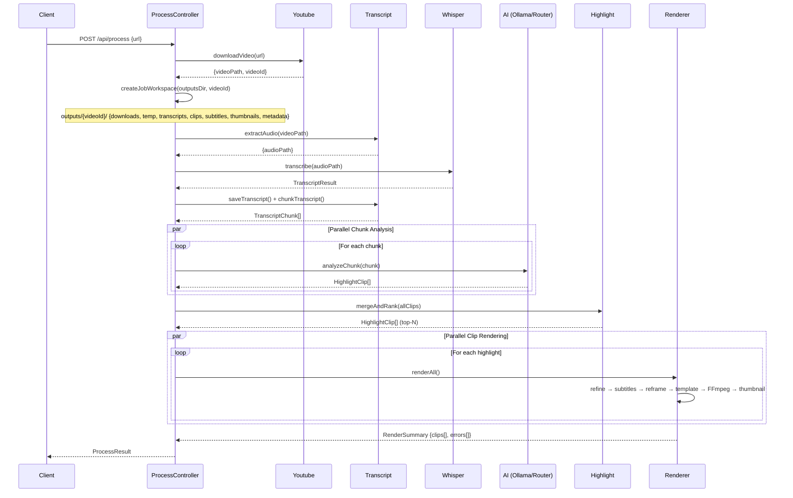

# Flow Process: Video Clip Builder

Diagram alur proses pembuatan klip video (`POST /api/process`) berdasarkan source code proyek.

## Mermaid Diagram



## Flow Description

### 1. Entry Point

- **Endpoint**: `POST /api/process` (handled by `server/api/process.post.ts`)
- **Controller**: `ProcessController.process()` di `src/controllers/process.controller.ts`
- **Input**: YouTube URL, template ID (opsional), channel info, acting_as persona, custom_prompt

### 2. Download Video

- **Service**: `YoutubeService` → yt-dlp CLI
- **Output**: MP4 file di `outputs/{videoId}/downloads/`
- **Retry**: Auto-retry hingga `maxRetries` kali
- **Error Handling**: Bot-check detection (butuh cookies), file existence validation

### 2b. Create Job Workspace

- **Utils**: `createJobWorkspace(outputsDir, videoId)` di `src/utils/workspace.ts`
- **Output**: Semua subdirektori di `outputs/{videoId}/` — `downloads/`, `temp/`, `transcripts/`, `clips/`, `subtitles/`, `thumbnails/`, `metadata/`
- **Tujuan**: Semua artifact satu video terisolasi & mudah di-trace

### 3. Extract Audio

- **Service**: `TranscriptService.extractAudio()` → FFmpeg
- **Output**: Mono 16kHz WAV di `outputs/{videoId}/temp/`
- **Purpose**: Format optimal untuk Whisper speech recognition

### 4. Transcribe Audio

- **Service**: `WhisperService.transcribe()`
- **Output**: Segments dengan word-level timestamps
- **Provider**: Whisper CLI (lokal) atau API

### 5. Save Transcript

- **Service**: `TranscriptService.saveTranscript()`
- **Output**: JSON di `outputs/{videoId}/transcripts/{videoId}.json`
- **Berisi**: Segments, words, timestamps, metadata

### 6. Chunk Transcript

- **Service**: `TranscriptService.chunkTranscript()`
- **Logic**: Split berdasarkan `chunkMaxTokens` dengan `chunkOverlapSeconds`
- **Boundary**: Selalu pecah di segment boundaries (tidak pernah mid-sentence)

### 7. Analyze Chunks (Parallel)

- **Service**: `OllamaService.analyzeChunk()` → AI (Ollama / 9Router / OpenAI-compatible)
- **Execution**: `Promise.allSettled()` — gagal 1 chunk tidak memblokir yang lain
- **Prompt**: System prompt viral/goal/MotoGP (tergantung `acting_as`) + custom_prompt
- **Output per chunk**: `HighlightClip[]` — kandidat viral clip dengan `{start, end, score, title, reason, hook}`
- **Retry**: Auto-retry per chunk hingga `maxRetries`
- **Validation**: Zod schema + JSON parsing toleran (fences, trailing commas)

### 8. Merge & Rank Highlights

- **Service**: `HighlightService.mergeAndRank()`
- **Dedup**: Overlapping clips (>50% overlap) di-merge, keep highest score
- **Clamp**: Duration dibatasi `[minClipSeconds, maxClipSeconds]`
- **Top-N**: Ambil N klip tertinggi berdasarkan score

### 9. Per-Clip Rendering (Concurrent)

Setiap highlight diproses secara konkuren via `mapWithConcurrency(maxConcurrency)`:

#### 9a. Refine Range
- **Service**: `ClipRefinementService.refine()`
- **Logic**: Snap ke segment boundaries, padding lead-in/trailing berdasarkan silence detection
- **Constraint**: Duration harus dalam `[minDurationSeconds, maxDurationSeconds]`

#### 9b. Build Subtitles
- **Service**: `SubtitleService.buildEvents()`
- **Logic**: Word-level timestamps → subtitle events (per maxWordsPerEvent)
- **Keyword Detection**: Highlight kata kunci (angka, emosi, action verbs, nama)

#### 9c. Resolve Focal Point
- **Service**: `ReframeService.resolveFocalPoint()`
- **Logic**: Extract frame → face detection → focal point (center-crop fallback)

#### 9d. Load Template
- **Service**: `TemplateService.load()` + `resolveLayers()`
- **Logic**: Load manifest → bind layers ke context → resolve layout
- **Template**: Data-driven (sports, podcast, news, dll) — renderer tidak tahu layout

#### 9e. Render Clip
- **Service**: `TemplateRendererService.compose()`
- **Logic**: Build FFmpeg filtergraph → compose video (crop 9:16 + subtitles + layers)
- **Output**: `outputs/{videoId}/clips/clip-{NNN}.mp4`

#### 9f. Validate Output
- **Check**: File exists, non-empty, duration matches expected (±2 detik)
- **Error**: `RenderFailure` dengan error code spesifik

#### 9g. Generate Thumbnail
- **Service**: `ThumbnailService.generateThumbnail()`
- **Logic**: Sample N frames → face detection → pick best (fallback: largest file)
- **Output**: `outputs/{videoId}/thumbnails/clip-{NNN}.jpg`

### 10. Save Metadata

- **Output**: `outputs/{videoId}/metadata/clips.json` — array RenderedClipMetadata

### 11. Return Result

```typescript
{
  video: string;      // source video path
  transcript: string; // transcript JSON path
  clips: RenderedClipMetadata[];  // rendered clips
  clipErrors: RenderError[];      // per-clip failures
}
```

## Key Architectural Patterns

1. **Fault Isolation**: `Promise.allSettled()` — 1 chunk/clip gagal ≠ semua gagal
2. **Concurrent Processing**: Chunk analysis + clip rendering dijalankan paralel
3. **Data-Driven Templates**: Renderer tidak tahu layout — template engine yang handle
4. **Silence-Aware Boundaries**: Refinement pakai silence detection untuk natural cuts
5. **Retry + Validation**: Setiap layer punya retry (download, AI, render) + output validation
6. **Config-Driven**: Semua batas, threshold, paths dikontrol via `.env`

## Sequence Diagram (Alternative View)


