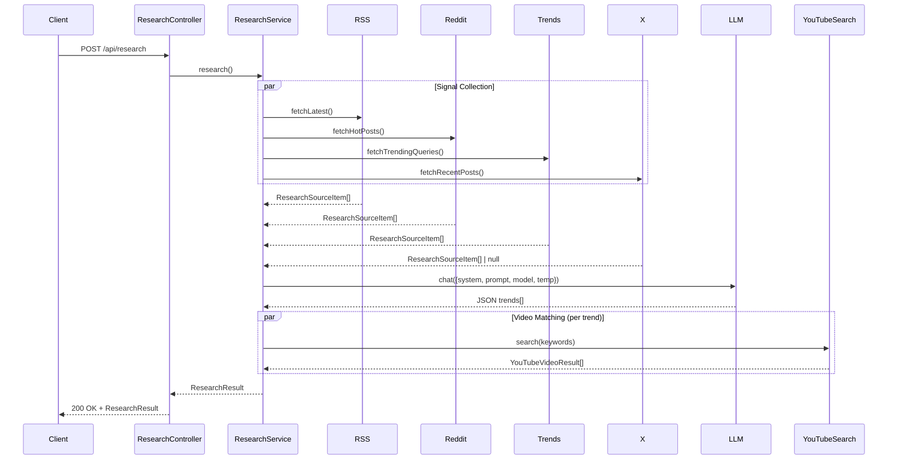

# Activity Diagram: Viral Content Research Pipeline

This diagram illustrates the complete flow of the viral topic research pipeline (`POST /api/research`) based on the project source code.

## Mermaid Diagram

```mermaid
activity-diagram
title Viral Topic Research Pipeline Flow

(*) --> "Start Research\nPOST /api/research"

"Start Research\nPOST /api/research" --> "Collect Signals\n(Parallel Collection)"

fork
    :RSS Provider\nfetchLatest();
    :Reddit Provider\nfetchHotPosts();
    :Trends Provider\nfetchTrendingQueries();
    :X Provider\nfetchRecentPosts();
fork again

"Collect Signals\n(Parallel Collection)" --> "Check Signal Count"

if "Signal Count == 0" then
    --> "Error: All sources\nfailed/unavailable"
    --> (*)
else
    --> "Analyze & Rank\nwith LLM"
endif

"Analyze & Rank\nwith LLM" --> "Parse LLM Response\n(JSON trends[])"

if "LLM returns\n0 trends" then
    --> "Error: No trends\nidentified"
    --> (*)
else
    --> "Slice Top N Trends\n(maxTrends from config)"
endif

"Slice Top N Trends\n(maxTrends from config)" --> "Attach YouTube Videos\n(Parallel per trend)"

fork
    :For each trend;
    :Extract keywords;
    :YouTube Search Provider\nsearch(keyword);
    :Fallback: yt-dlp search;
fork again

"Attach YouTube Videos\n(Parallel per trend)" --> "Build ResearchResult"

"Build ResearchResult" --> "Return ResearchResult\n{generatedAt, signalCount, trends[], skippedSources[]}"

"Return ResearchResult\n{generatedAt, signalCount, trends[], skippedSources[]}" --> (*)
```

## Flow Description

### 1. **Entry Point**

- **Endpoint**: `POST /api/research` (handled by `server/api/research.post.ts`)
- **Controller**: `ResearchController.research()` in `src/controllers/research.controller.ts`
- **Service**: `ResearchService.research()` in `src/research/research.service.ts`

### 2. **Signal Collection (Parallel)**

Four data sources are queried concurrently using `Promise.allSettled()`:

| Source        | Provider         | Method                   | Config                               |
| ------------- | ---------------- | ------------------------ | ------------------------------------ |
| **RSS**       | `RssProvider`    | `fetchLatest()`          | `RSS_FEEDS` env (array of feed URLs) |
| **Reddit**    | `RedditProvider` | `fetchHotPosts()`        | `REDDIT_SUBREDDITS` env              |
| **Trends**    | `TrendsProvider` | `fetchTrendingQueries()` | `TRENDS_GEO` env (optional)          |
| **X/Twitter** | `XProvider`      | `fetchRecentPosts()`     | `X_SEARCH_QUERY` env + `xurl` auth   |

**Error Handling**: Each source failure is isolated — logged and added to `skippedSources`, never fails the whole pipeline.

### 3. **Signal Validation**

- If **all sources return zero signals** → throws `AppError.researchSourceFailed`
- Otherwise proceeds with collected `ResearchSourceItem[]`

### 4. **LLM Analysis & Ranking**

- **Prompt Builder**: `buildResearchPrompt()` in `src/research/research.prompt.ts`
- **System Prompt**: "You are a viral-trend analyst for a short-video content studio. Respond with strict JSON only"
- **LLM Provider**: `OpenAiCompatibleLlm` (`src/research/llm.provider.ts`) — OpenAI-compatible `/v1/chat/completions`
  - Primary: Dedicated endpoint (when `RESEARCH_LLM_BASE_URL` configured)
  - Fallback: Main AI backend (router, then local Ollama) — same OpenAI-compatible API
- **Output**: Strict JSON with `trends[]` containing `slug, title, summary, score (0-100), keywords, category`

### 5. **Response Parsing**

- `parseResearchLlmResponse()` handles markdown fences, trailing commas
- Validates required fields, clamps score 0-100
- Sorts by score descending

### 6. **Top-N Selection**

- Slices to `maxTrends` (config: `RESEARCH_MAX_TRENDS`, default 10)

### 7. **YouTube Video Matching (Parallel)**

For each trend:

- Extract keywords (comma-separated, most specific first)
- **Primary**: YouTube Data API v3 (`search.list` + `videos.list`)
- **Fallback**: `yt-dlp ytsearchN:query` (when no API key)
- Attaches `YouTubeVideoResult[]` to each trend

### 8. **Result Assembly**

Returns `ResearchResult`:

```typescript
{
  generatedAt: ISO timestamp,
  signalCount: total raw signals collected,
  trends: ResearchTrend[] (with videos attached),
  skippedSources: { source, reason }[]
}
```

## Key Architectural Patterns

1. **Fault Isolation**: `Promise.allSettled()` ensures one dead source doesn't block others
2. **Graceful Degradation**: X/Trends are optional; pipeline continues without them
3. **Provider Abstraction**: Interfaces (`IRssProvider`, `IRedditProvider`, etc.) enable testing and swapping
4. **Config-Driven**: All limits, timeouts, sources controlled via `.env`
5. **Structured Logging**: Pino logger with component labels throughout

## Sequence Diagram (Alternative View)



## Configuration Reference (.env)

```bash
# Research pipeline
RESEARCH_MAX_TRENDS=10
RESEARCH_LANGUAGE=id

# Dedicated LLM (optional); when empty, the main AI backend
# (router → local Ollama) is used via /v1/chat/completions.
RESEARCH_LLM_BASE_URL=http://localhost:20128
RESEARCH_LLM_API_KEY=your-key
RESEARCH_LLM_MODEL=gpt-4o-mini
RESEARCH_LLM_TEMPERATURE=0.3
RESEARCH_LLM_TIMEOUT_MS=120000
RESEARCH_LLM_MAX_RETRIES=2

# RSS Feeds (JSON array)
RSS_FEEDS='[{"url":"https://www.cnnindonesia.com/rss","label":"cnn-indonesia","language":"id"}]'

# Reddit
REDDIT_SUBREDDITS='["indonesia","technology","worldnews"]'
REDDIT_MAX_POSTS=25
REDDIT_TIMEOUT_MS=15000

# Google Trends
TRENDS_MAX_QUERIES=20
TRENDS_GEO=ID

# X/Twitter
X_SEARCH_QUERY="breaking lang:en OR lang:id"
X_MAX_POSTS=20

# YouTube Search
YOUTUBE_API_KEY=your-api-key
YT_DLP_BINARY=yt-dlp
YOUTUBE_MAX_RESULTS=5
```
